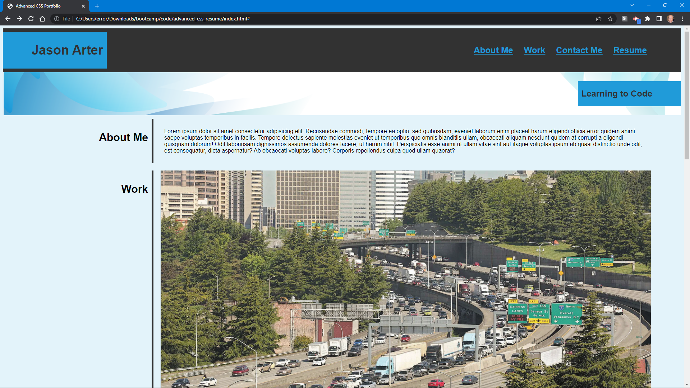

# Horiseon

## Description

I used this project to assess my current html and css skills. It uses background images, and css pseudo-classes.


## Table of Contents (Optional)

- [Installation](#installation)
- [Usage](#usage)
- [License](#license)
- [Contributions](#contributions)

## Installation

To install:
```
git pull git@github.com:error201/advanced_css_resume.git
```
Then open the ```index.html``` file in your browser of choice.

## Usage

Click the links and watch the magic happen.




## License

This project is covered under the MIT license. Please see [LICENSE](./LICENSE) for details.

---

## Contributions
All Images courtesy of Midjourney AI. Please see [this license](https://creativecommons.org/licenses/by-nc/4.0/legalcode) for use.


## Badges


## How to Contribute

Feel free to fork this repository!
